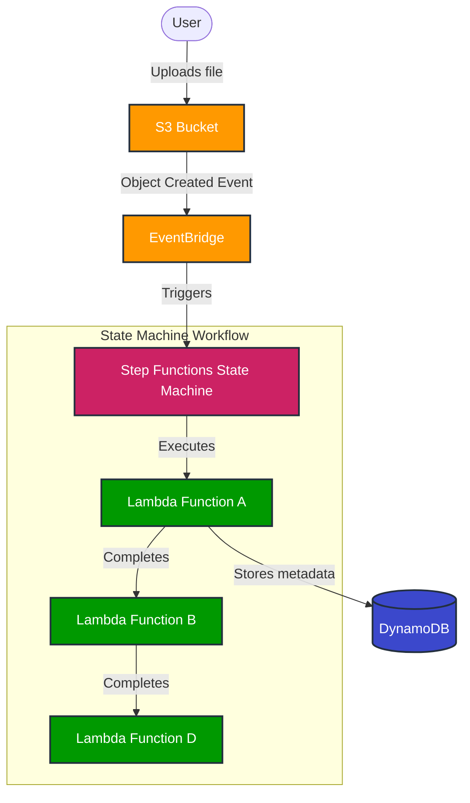

# AWS Step Functions Architecture Diagram

Below is an architecture diagram for the file processing workflow:



## Alternative Diagram for Export

If you need a PNG or SVG version, you can use this PlantUML code:

```plantuml
@startuml
!define AWSPuml https://raw.githubusercontent.com/awslabs/aws-icons-for-plantuml/v14.0/dist
!include AWSPuml/AWSCommon.puml
!include AWSPuml/Storage/SimpleStorageService.puml
!include AWSPuml/ApplicationIntegration/EventBridge.puml
!include AWSPuml/ApplicationIntegration/StepFunctions.puml
!include AWSPuml/Compute/Lambda.puml
!include AWSPuml/Database/DynamoDB.puml

actor User

User -> SimpleStorageService : 1. Uploads File
SimpleStorageService -> EventBridge : 2. Object Created Event
EventBridge -> StepFunctions : 3. Triggers State Machine

package "Step Functions Workflow" {
  StepFunctions -> Lambda as "LambdaA" : 4. Execute Lambda A
  "LambdaA" -> DynamoDB : 5. Store File Metadata
  "LambdaA" -> Lambda as "LambdaB" : 6. Complete & Execute Lambda B
  "LambdaB" -> Lambda as "LambdaD" : 7. Complete & Execute Lambda D
}

@enduml
```

You can render these diagrams:
1. For Mermaid: Use a Markdown editor that supports Mermaid, GitHub, or tools like [Mermaid Live Editor](https://mermaid.live)
2. For PlantUML: Use [PlantUML Online Server](https://www.plantuml.com/plantuml/uml/)

## AWS Architecture Diagram

Below is a simplified AWS service architecture diagram:

```
┌─────────────┐     ┌─────────────┐     ┌─────────────────────┐
│             │     │             │     │                     │
│    User     │────▶│  S3 Bucket  │────▶│     EventBridge     │
│             │     │             │     │                     │
└─────────────┘     └─────────────┘     └──────────┬──────────┘
                                                   │
                                                   ▼
┌─────────────┐                      ┌─────────────────────────┐
│             │                      │                         │
│  DynamoDB   │◀─────────────────────│  Step Functions         │
│  Table      │                      │  State Machine          │
│             │                      │                         │
└─────────────┘                      └─────────────┬───────────┘
                                                   │
                                        ┌──────────┴──────────┐
                                        │                     │
                                        ▼                     ▼
                            ┌─────────────────┐     ┌─────────────────┐
                            │                 │     │                 │
                            │   Lambda A      │────▶│    Lambda B     │
                            │                 │     │                 │
                            └─────────────────┘     └────────┬────────┘
                                                             │
                                                             ▼
                                                   ┌─────────────────┐
                                                   │                 │
                                                   │    Lambda D     │
                                                   │                 │
                                                   └─────────────────┘
``` 